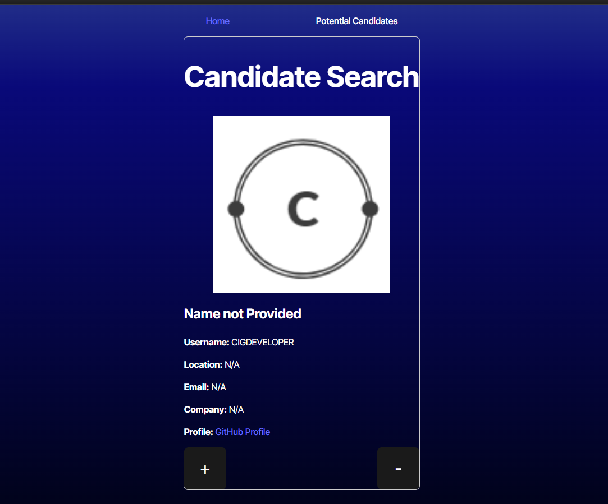
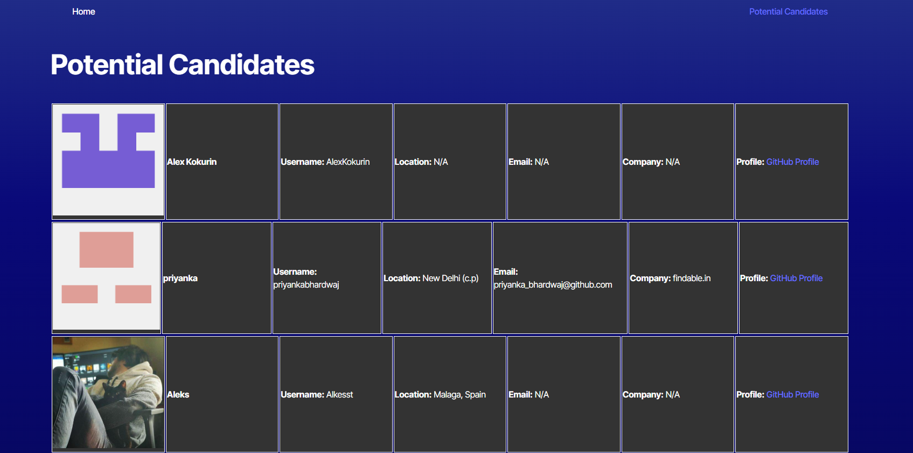

# 13-Challenge-TypeScript-App

## Description
AS AN employer I WANT a candidate search application SO THAT I can hire the best candidates

## Installation

No installation is needed

## Usage

The application is used to look for canidate to hire for a postion. What you do is on the homepage click the + button on the canadtes you like and - on the ones you do not. After that you can go to the 

*This is a screenshot of the Canadidate Search.*

*This is a screenshot of the Saved Candidates.*

[Link to App](https://one3-challenge-typescript-app.onrender.com)
